# Cab-Booking System
Cab Booking System Using Spring Boot and Spring Security (Email OTP Verification)

## Features
- Spring Security With Basic Authentication
- Relational Mapping One To Many and Many to One
- lombok
- Spring Data Validation
- Spring Data JPA and MySQL Database (Native Query)
- Spring Boot Entire Model With DTO
- HTTP Status and Methods
- Exception Handling Using Global Exception and Custom Exception
- Stream API and Lambda Expression
- Solid Principles
- CRUD Features
- Easy to Understand Code
 

## Installation
- Just, Clone this repository - 
````bash 
git clone https://github.com/SLoharkar/Cab-Booking-System.git
````
- Run File Using Any Java Application Like Eclipse IDE For Java Developer or Visual Studio Code


## Website Trailer


## Website Highlights
<p align="left" width="100%">

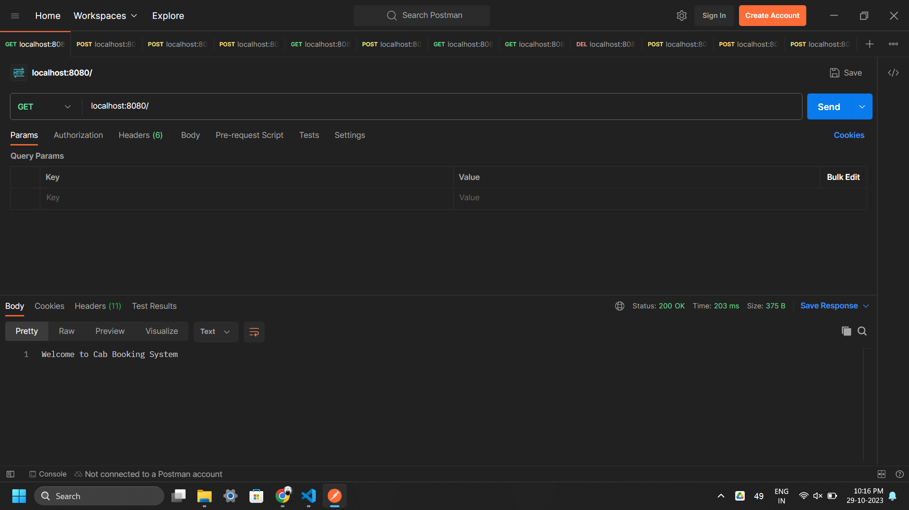
  
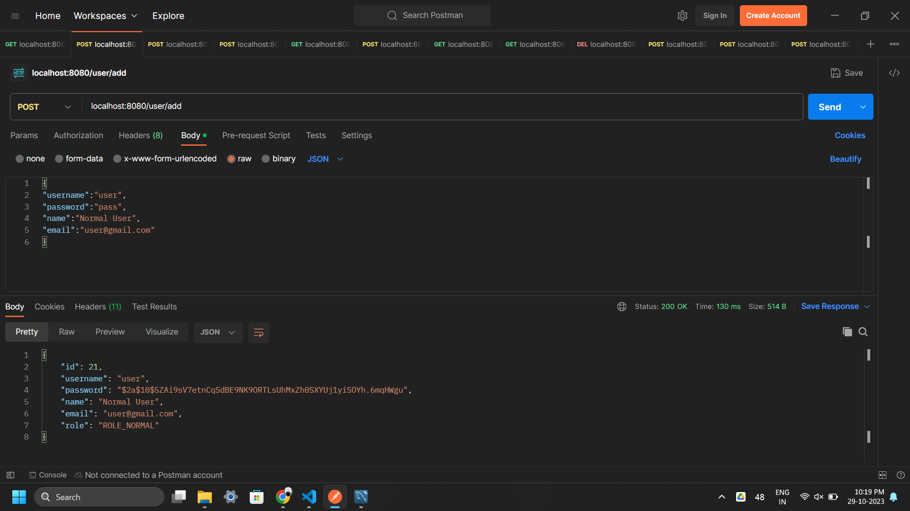

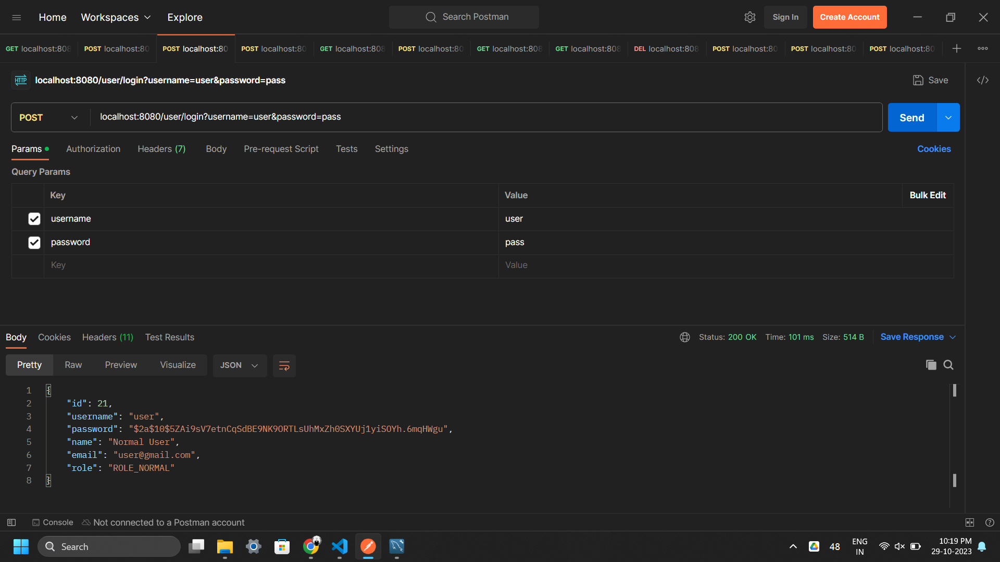

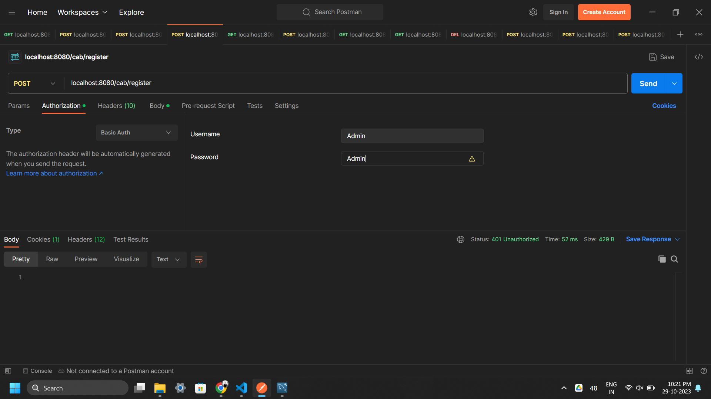

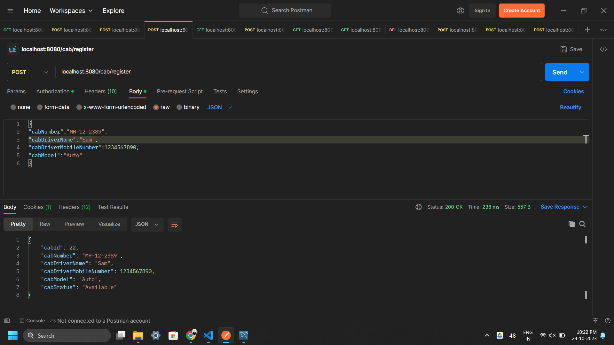

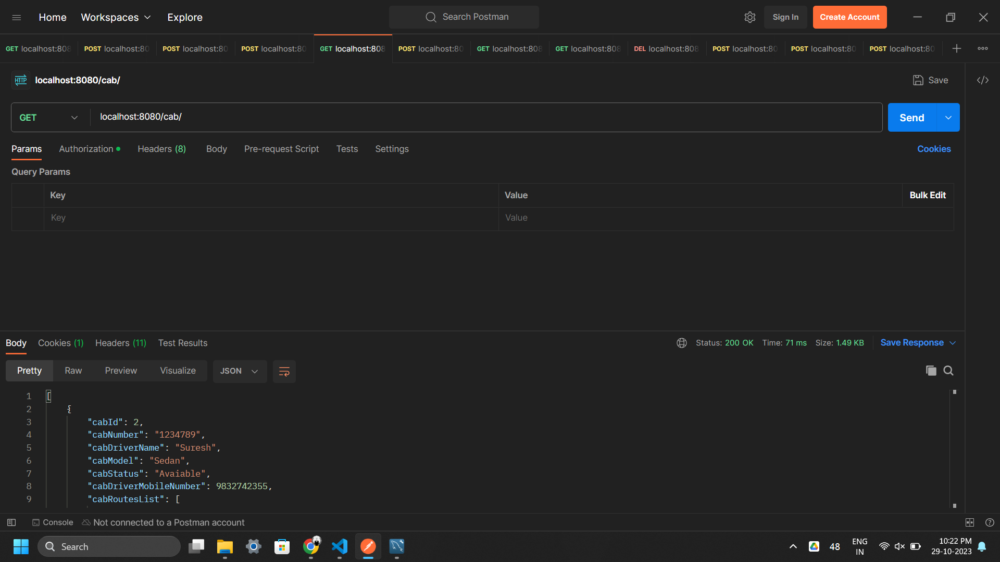

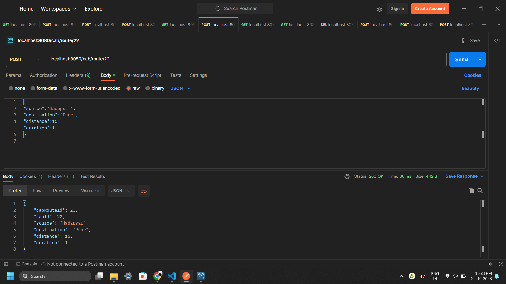

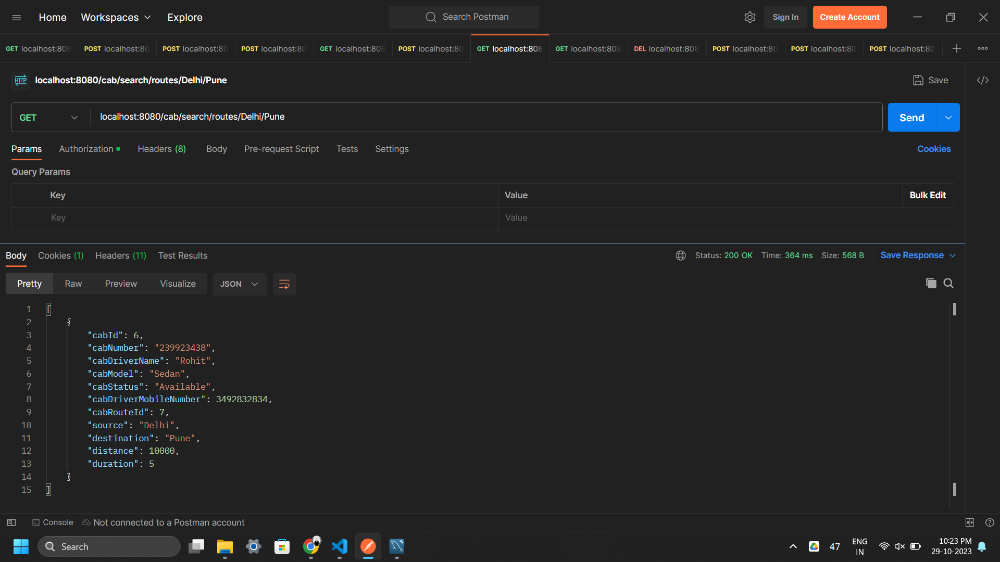

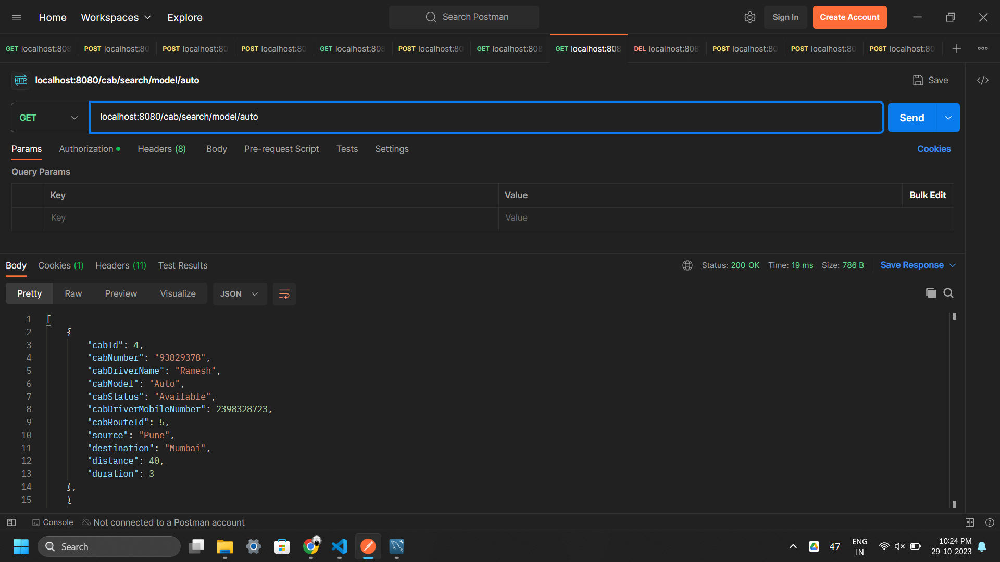

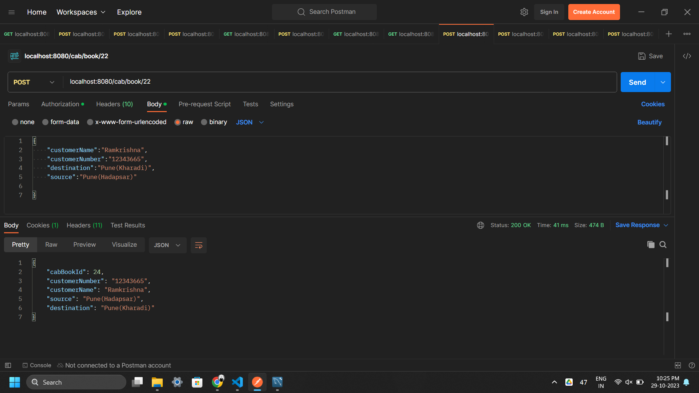

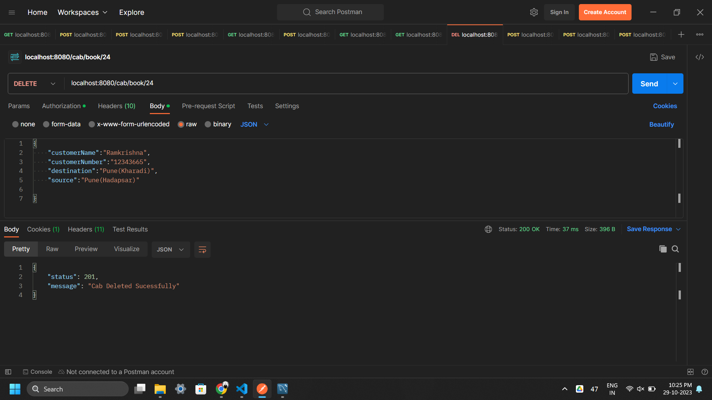

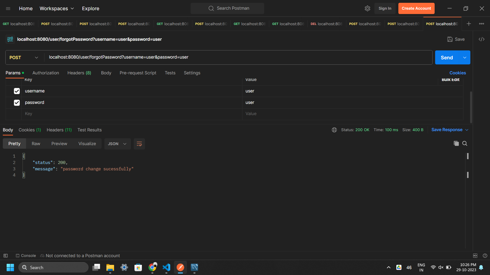

</p>


## Dependencies
- `Visual Studio Code (VS Code)`
- `java-11`
- `Spring Boot Version 2.7.8`
- `Postman`
- `Windows 11`

